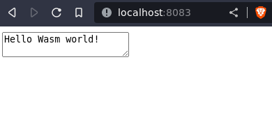

title: Hello WASM World!
---

## Introduction

This example walks through how to compile a *hello world* executable written in C++ to [WebAssembly](https://webassembly.org/) and how to execute it with standalone WebAssembly runtimes, the Node.js JavaScript runtime, and web browser runtimes!

Before getting started, make sure [Node.js](https://nodejs.org/en/download/) and [Docker](https://docs.docker.com/install/) are installed. On Linux, make sure you can run [`docker` without `sudo`](https://askubuntu.com/questions/477551/how-can-i-use-docker-without-sudo). On Windows, we recommend [WSL 2 with Docker enabled](https://docs.docker.com/desktop/windows/wsl/).

While we recommend following along step-by-step, the complete examples can also be found in the [`examples/` directory of the project repository](https://github.com/InsightSoftwareConsortium/itk-wasm/tree/master/examples).

## Write the code

First, let's create a new directory to house our project.

```sh
mkdir HelloWorld
cd HelloWorld
```

Let's write some code! Populate *hello.cxx* with our Hello World program:

```c++
#include <iostream>

int main() {
  std::cout << "Hello WASM world!" << std::endl;
  return 0;
}
```

Next, provide a [CMake](https://cmake.org/) build configuration at *CMakeLists.txt*:

```cmake
cmake_minimum_required(VERSION 3.16)
project(HelloWorld)

add_executable(hello hello.cxx)
```

## Install itk-wasm

We use the `add_executable` command to build executables with itk-wasm. The [Emscripten](https://kripken.github.io/emscripten-site/) and [WASI](https://github.com/WebAssembly/wasi-sdk) toolchains along with itk-wasm build and execution configurations are contained in the itk-wasm [dockcross](https://github.com/dockcross/dockcross) Docker images used by the itk-wasm command line interface (CLI).  Note that the same code can also be built and tested with native operating system toolchains. This is useful for development and debugging.

Build the program with the itk-wasm CLI, `itk-wasm`. This is shipped with the `itk-wasm` Node.js package. First install *itk-wasm* with the Node Package Manager, `npm`, the CLI that ships with Node.js.

```sh
npm install --global itk-wasm
```

## WASI

Build the project with the WASI `itkwasm/wasi` toolchain in the `./wasi-build/` directory:

```sh
itk-wasm -i itkwasm/wasi -b ./wasi-build/ build
```

A `hello.wasi.wasm` WebAssembly binary is built in the `./wasi-build/` directory.

```sh
❯ ls wasi-build
build.ninja          CMakeFiles          libwasi-exception-shim.a
cmake_install.cmake  hello.wasi.wasm
```

Execute the binary with the `run` `itk-wasm` subcommand.

```sh
❯ itk-wasm -b ./wasi-build/ run hello.wasi.wasm
Hello WASM world!
```

Congratulations! You just executed a C++ program compiled to WebAssembly. 🎉

The binary can also be executed with any of the available [WASI runtimes](https://github.com/mbasso/awesome-wasm#non-web-embeddings).

## Node.js

For Node.js or the Browser, build the project with the default [Emscripten](https://emscripten.org/) toolchain. The project is built in the `./web-build` directory by default.

```sh
itk-wasm build
```

To execute the project, create an `index.mjs` JavaScript file to [invoke the module](../api/node_pipelines.html):

```
import path from 'path'
import { runPipelineNode } from 'itk-wasm'

const pipelinePath = path.resolve('web-build', 'hello')
runPipelineNode(pipelinePath)
```

And run it!

```sh
❯ npx node ./index.mjs
Hello WASM world!
```

Congratulations! You just executed a C++ program in JavaScript. 🎉

## Browser

The same Emscripten WebAssembly module can be executed in a web browser.

Create an HTML file that will call the WebAssembly module through JavaScript and display
its output in the HTML DOM:

```html
<!DOCTYPE html>
<html>
  <head>
    <title>itk-wasm Browser Hello World!</title>
    <meta charset="UTF-8" />
    <script src="https://cdn.jsdelivr.net/npm/itk-wasm@1.0.0-b.6/dist/umd/itk-wasm.min.js"></script>
  </head>

  <body>
    <textarea readonly>WebAssembly output...</textarea>

    <script>
      const outputTextArea = document.querySelector("textarea");
      outputTextArea.textContent = "Loading...";

      const wasmURL = new URL('web-build/hello', document.location)
      const args = []
      const inputs = null
      const outputs = null
      itk.runPipeline(null, wasmURL, args, inputs, outputs).then(
        ({ stdout, webWorker }) => {
          webWorker.terminate()
          outputTextArea.textContent = stdout
          })
    </script>
  </body>
</html>
```

Serve the with an http server:

```sh
npm install --global http-server
http-server .
```

And point your browser to `http://127.0.0.1:8080/`.



Congratulations! You just executed a C++ program in your web browser. 🎉
