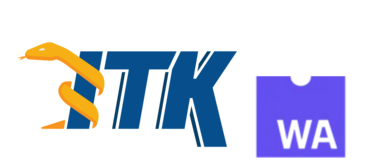

itkwasm
=======

> Universal spatial analysis and visualization.

<div align="center">



[](https://github.com/InsightSoftwareConsortium/itk-wasm/actions/workflows/examples.yml) [](https://github.com/InsightSoftwareConsortium/itk-wasm/actions/workflows/toolchains.yml) [](https://github.com/InsightSoftwareConsortium/itk-wasm/actions/workflows/javascript-typescript.yml) [](https://github.com/InsightSoftwareConsortium/itk-wasm/actions/workflows/python-wasm.yml) [](https://github.com/InsightSoftwareConsortium/itk-wasm/actions/workflows/cxx-python.yml) [](https://github.com/InsightSoftwareConsortium/itk-wasm/actions/workflows/wasi.yml)

[](https://www.npmjs.com/package/itk-wasm)
[](https://pypi.org/project/itkwasm/)

[](https://zenodo.org/badge/latestdoi/45812381)

 
</div>

*itk-wasm* combines [ITK](https://www.itk.org/) and [WebAssembly](https://webassembly.org/) to enable high-performance spatial analysis in a web browser or system-level environments and reproducible execution across programming languages and hardware architectures.

The project provides tools to

- build C/C++ code to [WebAssembly](https://webassembly.org/).
- bridge local filesystems, JavaScript/TypeScript/Python data structures, and traditional file formats.
- transfer data efficiently in and out of the WebAssembly runtime.
- perform asynchronous, parallel execution of processing pipelines in a worker pool.

*itk-wasm* can be used to execute [ITK](https://www.itk.org/) or arbitrary C++ codes in the browser, on the command line, and in languages like Python via [WASI](https://wasi.dev/) and [Emscripten](https://emscripten.org) runtimes.

```{toctree}
:hidden:
:maxdepth: 3
:caption: 👋 Introduction

introduction/packages.md
introduction/file_formats/index.md
```

```{toctree}
:hidden:
:maxdepth: 3
:caption: 🌐 JavaScript/TypeScript

typescript/interface_types/index.md
typescript/index.md
typescript/distribution/index.md
```

```{toctree}
:hidden:
:maxdepth: 3
:caption: 🐍 Python

python/introduction.md
python/numpy.md
python/itk_python.md
apidocs/index.rst
```

```{toctree}
:hidden:
:maxdepth: 3
:caption: 📖 C++ Wasm Processing Pipelines

cxx/installation.md
cxx/tutorial/index.md
cxx/interface_types.md
```

```{toctree}
:hidden:
:maxdepth: 3
:caption: 🔨 ITK-Wasm Development

development/hacking_itk_wasm.md
development/itk_js_to_itk_wasm_migration_guide.md
```
